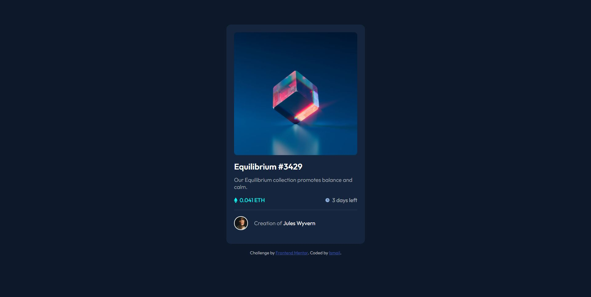

# Frontend Mentor - NFT preview card component solution

This is a solution to the [NFT preview card component challenge on Frontend Mentor](https://www.frontendmentor.io/challenges/nft-preview-card-component-SbdUL_w0U). Frontend Mentor challenges help you improve your coding skills by building realistic projects.

## Table of contents

- [Overview](#overview)
  - [The challenge](#the-challenge)
  - [Screenshot](#screenshot)
  - [Links](#links)
- [My process](#my-process)
  - [Built with](#built-with)
  - [What I learned](#what-i-learned)
  - [Continued development](#continued-development)
  - [Useful resources](#useful-resources)
- [Author](#author)
- [Acknowledgments](#acknowledgments)

**Note: Delete this note and update the table of contents based on what sections you keep.**

## Overview

To create an NFT card component as close to the design files provided.

### The challenge

Users should be able to:

- View the optimal layout depending on their device's screen size
- See hover states for interactive elements

### Screenshot



### Links

- Solution URL: [here](https://github.com/Ishi1834/nft-preview-card)
- Live Site URL: [here](https://ishi1834.github.io/nft-preview-card/)

### Built with

- Semantic HTML5 markup
- CSS custom properties
- Flexbox
- Mobile-first workflow

### What I learned

How to change the background color of an image using z-index properties:

```html
<article class="mainImg">
  
  <div></div>
</article>
```

```css
.mainImg div {
  cursor: pointer;
  position: absolute;
  background-color: hsl(178, 100%, 50%, 40%);
  top: 0;
  width: 100%;
  height: 99%;
  z-index: 1;
  border-radius: 10px;
  opacity: 0;
  transition: opacity 0.2s ease-in-out;
}
.mainImg div:hover {
  opacity: 1;
}
```

### Useful resources

- [Youtube video](https://www.youtube.com/watch?v=9bGbykdR4T8&ab_channel=tsbsankara) - This helped me understand how to use the z-index to change the image color on hover.

## Author

- Github - [@Ishi1834](https://github.com/Ishi1834)
- Frontend Mentor - [@Ishi1834](https://www.frontendmentor.io/profile/Ishi1834)
- CodePen - [@sadiq1834](https://codepen.io/sadiq1834)
